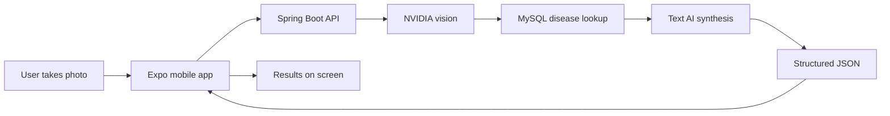

# UPAVANA Plant Doctor — System Overview

**Purpose:** Short, shareable description of the tech stack and how a diagnosis flows end to end.  
**Last updated:** 2026-09-23  
**For deep setup, drift notes, and risks:** see [HANDOVER.md](./HANDOVER.md).

---

## One-line summary

UPAVANA Plant Doctor is a **mobile app** where you photograph a plant; a **Java API** uses AI on the image, checks a **disease database**, and returns a structured diagnosis (what’s wrong, what to do, and how confident the system is).

---

## Tech stack

| Layer | Technology | Role |
|--------|------------|------|
| **Mobile app** | React Native + **Expo** (`mobile/`) | Camera/gallery, upload, loading, results (including formatted guidance text) |
| **API** | **Java 21** + **Spring Boot** (`backend/`) | REST API; main endpoint `POST /api/diagnose` |
| **Database** | **MySQL** | Plants, diseases, and saved query history (seeded from CSV) |
| **Vision AI** | **NVIDIA NIM** (vision model) | Always used to describe what’s visible in the photo |
| **Diagnosis text AI** | Env: **`ACTIVE_SYNTHESIS_PROVIDER`** | **`groq`**, **`openai`** (gpt-4o), or **`deepseek`** (DeepSeek via NVIDIA NIM). On failure → **NVIDIA NIM text** fallback |
| **Configuration** | Backend **`.env`** | API keys, synthesis provider (not committed to git) |
| **Marketing site** | Next.js (repo root site) | Separate from the app; **not** part of the diagnose flow |

---

## End-to-end flow

### Step by step

1. **User** captures or selects a plant photo on the phone.
2. **Mobile app** uploads the image to the backend (`POST /api/diagnose` with field `image`), typically to `http://<developer-machine>:8080` on a local/LAN demo.
3. **Backend** stores the image and sends it to **NVIDIA vision**, which returns a text description of symptoms and visible damage.
4. **Backend** queries **MySQL**: matches diseases by plant name and symptom keywords from that description (keyword-style retrieval, not vector embeddings). It keeps a small shortlist of candidates.
5. **Backend** calls the configured **synthesis** provider (Groq, OpenAI, or DeepSeek-on-NVIDIA) with the vision text plus DB candidates. The model returns structured JSON: plant name, issue, matched symptoms, recommended action, confidence note, healthy vs not healthy.
6. **Health consistency** logic on the server can adjust “healthy” when physical damage in the result doesn’t match a healthy label.
7. The result is **saved** in the database and returned to the app.
8. **App** displays the diagnosis; solution text can use **bold** and line breaks for readability.

---

## AI in plain language

| Piece | What it does |
|--------|----------------|
| **Eyes** | **NVIDIA NIM vision** — always analyzes the photo. Requires `NVIDIA_API_KEY`. |
| **Writer** | **Groq**, **OpenAI**, or **DeepSeek (via NVIDIA)** — chosen by `ACTIVE_SYNTHESIS_PROVIDER`. Default in repo examples is **`deepseek`**. |
| **Backup writer** | **NVIDIA NIM text** if the primary synthesis call fails or keys are missing. |
| **Reference book** | **MySQL** disease data from curated CSV — grounds answers in your knowledge base, not free-form guessing. |

Vision does **not** switch to Gemini or OpenAI in the current `main` branch; only NVIDIA NIM is used for images.

---

## What you need for a local demo

1. **MySQL** running; backend started; disease data **seeded** (e.g. `POST /api/admin/seed` or seed-on-startup).
2. **`.env`** in `backend/` with at least **`NVIDIA_API_KEY`** (vision + default DeepSeek-on-NVIDIA synthesis).
3. Optionally **`GROQ_API_KEY`** or **`OPENAI_API_KEY`** if `ACTIVE_SYNTHESIS_PROVIDER` is `groq` or `openai`.
4. **Expo** dev server for `mobile/`, with the app reaching the API on port **8080**.

Check **`GET /api/health`** for database connectivity and table row counts.

---

## What is not in scope on `main` yet

| Item | Status |
|------|--------|
| **Follow-up chat** after a diagnosis | Not started (planned phase 5) |
| **Session history** on Home | In-memory only; lost when the app restarts |
| **Production hosting / CI** | Local/LAN demo focus |

---

## Quick pitch (30 seconds)

“We built a plant doctor app: React Native on the phone talks to a Spring Boot API and MySQL. NVIDIA looks at the photo; we match symptoms to our disease database; then Groq, OpenAI, or DeepSeek-on-NVIDIA writes a structured diagnosis with treatment steps. Keys and provider live in `.env` on the server.”

---

## Related docs

- [REPO-STRUCTURE.md](./REPO-STRUCTURE.md) — monorepo layout, backend/mobile/env map  
- [DATABASE.md](./DATABASE.md) — MySQL tables and CREATE SQL  
- [docs/README.md](./docs/README.md) — documentation index  
- [AGENTS.md](./AGENTS.md) — agent/build rules and phase list  
- [HANDOVER.md](./HANDOVER.md) — detailed developer handover, test status, doc drift, branch history  
