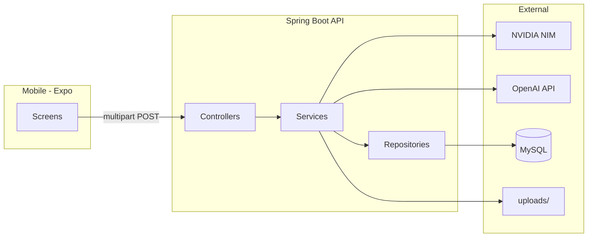
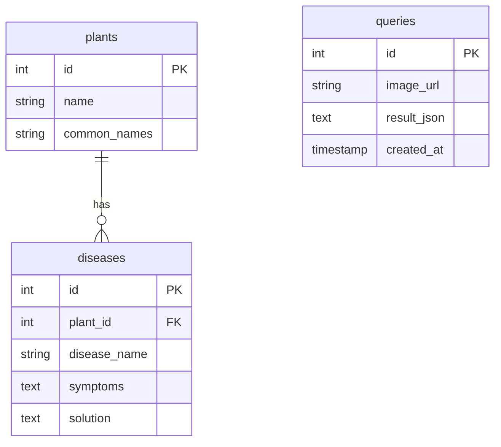
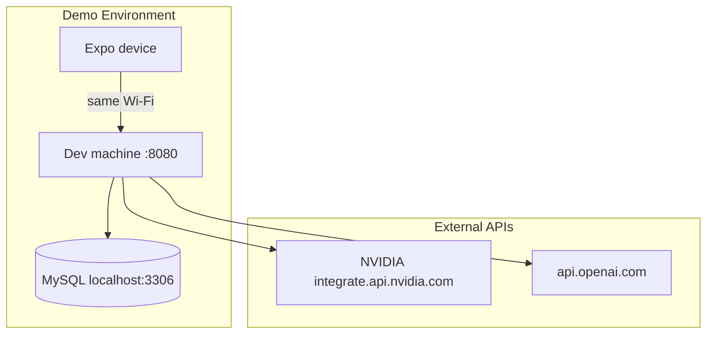

# Architecture Spine — Plant Doctor MVP

> **Sir / scan:** read [`TECHNICAL-PICTURE.md`](TECHNICAL-PICTURE.md) only (~1 min). This file is the builder contract (ADs). Do not send this spine as the review pack.

## Design Paradigm

**Layered monolith (backend) + diagnosis pipeline (RAG).**

| Layer | Location | Responsibility |
|-------|----------|----------------|
| **Presentation** | `mobile/src/screens/` | Capture photo, call API, render Diagnosis |
| **API** | `backend/.../controller/` | HTTP boundary, request validation, error mapping |
| **Application** | `backend/.../service/` | Diagnosis orchestration, AI client calls |
| **Domain + persistence** | `backend/.../entity/`, `repository/` | Plants, diseases, queries |
| **Infrastructure** | Flyway, MySQL, NVIDIA + OpenAI HTTP, DeepSeek code (inactive), `uploads/` | External I/O |

Linear pipeline (not event-driven): Vision → Retrieve → Synthesize → Persist → Respond. No stage skips retrieval or returns Diagnosis before synthesis completes.



## Invariants & Rules

### AD-1 — Client-server boundary

- **Binds:** FR-3, FR-9, all mobile features
- **Prevents:** Business logic or AI calls in the mobile app; duplicate diagnosis rules on client
- **Rule:** Mobile talks to backend **only** via REST over HTTP. No AI provider calls from mobile. No on-device diagnosis in MVP. [ADOPTED]

### AD-2 — Diagnosis API contract

- **Binds:** FR-3, FR-9, FR-10, FR-19
- **Prevents:** Breaking mobile integration; camelCase/snake_case drift; two clients inventing different treatment JSON
- **Rule:** `POST /api/diagnose` accepts `multipart/form-data` field **`image`**. Success body is snake_case `DiagnosisResult`: `plant_name`, `disease_name`, `symptoms_matched`, `solution`, `confidence_note`, `is_healthy`, `treatment_type`, optional `treatment_steps`. Errors: `{ "error": "<message>" }` with HTTP 400 or 500.
- **`treatment_type`:** JSON strings exactly `"single_action"` or `"care_plan"` (lowercase snake). Store as strings (or `@JsonValue` if an enum). Never serialize Java enum names like `SINGLE_ACTION`.
- **UI switch:** Render from `treatment_type`, not from whether `treatment_steps` is truthy.
- **`treatment_steps`:** JSON array of objects `{ "day": string, "action": string }`. `day` and `action` are **strings** (not numbers). `day` is a short label (e.g. `"Day 1"`), not a schema-enforced calendar date.
- **`single_action`:** `solution` is one short instruction. `treatment_steps` is omitted or `null` — **not** `[]`.
- **`care_plan`:** `treatment_steps` has **3–5** items. `solution` is a one-line summary only; the ordered actions live in `treatment_steps`, not a second checklist in `solution`. Count outside 3–5 → incomplete result (retry/fallback), do not clamp.
- **Compat:** Additive fields. Java `DiagnosisResult` and mobile parsers keep `@JsonIgnoreProperties(ignoreUnknown = true)` / equivalent so **older clients ignore unknown keys**. Missing `treatment_type` from a lagging producer is **not** filled with a care plan — consumers use `solution` as a single instruction. Mobile `DiagnosisData` mirrors the contract (new fields optional until the app ships FR-19 UI).
- [ADOPTED — revised 2026-08-29; FR-19]

### AD-3 — Dual RAG retrieval

- **Binds:** FR-6, FR-7, D-4
- **Prevents:** Missing KB hits when vision names the plant wrong; dumping the full KB into synthesis
- **Rule:** `findCandidateDiseases()` builds a **bounded** `List<DiseaseCandidate>`:
  1. **Plant-name** — vision text matches plant `name` or comma-separated `common_names` → `MatchType.PLANT_NAME` (High-tier trigger). Always include these.
  2. **Symptom-pattern** — remaining diseases scored on vision vs `symptoms` + `disease_name` across **all plants**; include top hits above the minimum score, cap `MAX_SYMPTOM_CANDIDATES` → `MatchType.SYMPTOM_PATTERN` (Medium-tier trigger).
- Candidates passed to synthesis must carry match type (`PLANT_NAME_MATCH` / `SYMPTOM_PATTERN_MATCH` in prompts). [ADOPTED — revised 2026-08-14; supersedes plant-name-only]

### AD-4 — Empty retrieval only when neither match

- **Binds:** FR-6, FR-7, FR-12
- **Prevents:** Passing the entire Knowledge Base; treating Unidentified Issue as an error
- **Rule:** Empty candidate list **only** when there is no plant-name match **and** no symptom-pattern match. Synthesis then uses labeled general guidance (Low tier): `disease_name` = `Unidentified Issue`, `is_healthy` = `false`. Do not invent a KB-grounded, species-specific disease without a candidate. [ADOPTED — revised 2026-08-14]

### AD-5 — Diagnosis pipeline ordering

- **Binds:** FR-5, FR-6, FR-7, FR-8
- **Prevents:** Persisting or returning results before synthesis; skipping vision or retrieval
- **Rule:** `DiagnosisService.diagnosePlant()` order: (1) save image, (2) Vision Analysis, (3) retrieve candidates, (4) Synthesize, (5) persist Query, (6) return Diagnosis. No other order without a new AD. [ADOPTED]

### AD-6 — AI provider chain

- **Binds:** FR-5, FR-7, DAC-6, D-1, D-7, D-8
- **Prevents:** Ad-hoc model swaps without config; unbounded retries vs mobile 180s budget
- **Rule — Vision (required):** NVIDIA NIM only. Model `meta/llama-3.2-11b-vision-instruct`. `NVIDIA_API_KEY` required — missing key is a **clear server error**, not silent fail. 25s timeout, max 2 attempts. Prompt: leaf morphology, growth habit, honest uncertainty, detailed symptoms. **Not** OpenAI vision. **Not** Claude.
- **Rule — Synthesis target (D-7 / D-8):** OpenAI Chat Completions **`gpt-4o`** + `json_schema` matching `DiagnosisResult`. Intended happy path when billing is approved. Switch via `ACTIVE_SYNTHESIS_PROVIDER=openai` (restart). This AD does **not** reverse D-7/D-8.
- **Rule — Synthesis runtime (2026-08-27, temporary):** Default `ACTIVE_SYNTHESIS_PROVIDER=deepseek` because OpenAI prepaid billing is blocked. `diagnosePlant()` calls `synthesizeDiagnosisWithDeepSeek`. OpenAI methods stay in the repo. Flip env to `openai` when stakeholder approves billing — no code change.
- **Rule — Synthesis fallback:** On primary failure or missing key → NVIDIA NIM text **`openai/gpt-oss-20b`** (hosted; `meta/llama-3.1-8b-instruct` EOL 2026-08-26 / 410 Gone), 25s, max 2 attempts. DAC-6 still required before stakeholder demo.
- **Rule — DeepSeek:** Required for current MVP runtime default. Code path already existed; now selected by config. `DEEPSEEK_API_KEY` required when provider is `deepseek`.
- **Rule — gpt-4o-mini:** Not used for MVP diagnosis. Reserved for post-MVP high-frequency chat.
- **Budget:** Whole pipeline ≤ mobile **180s** abort.
- **Note:** Reversible config default, not a reversal of D-7/D-8. [ADOPTED — runtime default DeepSeek 2026-08-27]

### AD-7 — Synthesis output + confidence tiers

- **Binds:** FR-7, FR-10, FR-11, FR-12, FR-19
- **Prevents:** Unparseable AI output; High-tier copy on Medium/Low matches; every problem getting the same multi-step essay
- **Rule:** Output matches `DiagnosisResult`. Strip markdown fences via `extractJson()` before deserialize. `@JsonIgnoreProperties(ignoreUnknown = true)`.
  | Tier | Trigger | Output |
  |------|---------|--------|
  | **High** | `PLANT_NAME` candidate | KB-grounded `solution`; species-specific treatment allowed |
  | **Medium** | Symptom-pattern only | May use matched disease/solution; `confidence_note` must say plant type was **not** confirmed in KB |
  | **Low** | No candidates | `Unidentified Issue`; labeled general guidance; no species-specific certainty |
  | **Healthy** | No disease | `disease_name` `Healthy`, `is_healthy: true` |
- Every diagnosis sets `confidence_note` with High / Medium / Low (or healthy).
- **Treatment shape (all tiers, including Healthy and Low):** The model **chooses** `treatment_type` from the actual problem. It must not default every issue to a generic multi-step checklist, and must not default every issue to `single_action`. `care_plan` only when the problem genuinely needs repeated or multi-day care; then `treatment_steps` is 3–5 `{ day, action }` items, concise. `single_action` when one done-when-done step suffices; then `solution` is that step and `treatment_steps` is omitted/empty.
- **Schema / prompts:** OpenAI `json_schema` and every `NvidiaClientService` synthesis method describe `treatment_type` and `treatment_steps` (`day`/`action` typed as strings). Under strict `json_schema`, declare `treatment_steps` as a **nullable** array so the model can emit `null` for `single_action` without inventing steps. Persist the full JSON in `queries.result_json`.
- [ADOPTED — revised 2026-08-29; FR-19]

### AD-8 — Schema evolution via Flyway

- **Binds:** FR-16, Knowledge Base
- **Prevents:** Hibernate auto-DDL drift
- **Rule:** Schema only via `backend/src/main/resources/db/migration/V*__*.sql`. `spring.jpa.hibernate.ddl-auto: validate`. [ADOPTED]

### AD-9 — Knowledge Base seeding source

- **Binds:** FR-16, FR-17
- **Prevents:** Hardcoded plant/disease rows in Java
- **Rule:** Plants/diseases enter **only** via CSV seed or `POST /api/admin/seed`. Header: `plant_name,disease_name,description,symptoms,causes,solution`. Re-seed skips duplicate plant+disease pairs. Must-pass demo pairs come from stakeholder OQ-1 — not assumed here. [ADOPTED]

### AD-10 — No authentication (MVP)

- **Binds:** all API endpoints
- **Prevents:** Auth scope-creep mid-sprint
- **Rule:** No user auth, sessions, or client API keys in MVP. Admin seed is demo-LAN only — not internet-facing without a future AD. [ADOPTED]

### AD-11 — Secrets and configuration

- **Binds:** FR-5, FR-7, operations
- **Prevents:** Committed credentials
- **Rule:** Keys and DB creds via env vars in `application.yml` (`${VAR:default}`). `.env` gitignored; Spring Boot does not auto-load `.env`. `@ConfigurationProperties` for AI config. Demo needs `NVIDIA_API_KEY` + `OPENAI_API_KEY`. [ADOPTED]

### AD-12 — Mobile API endpoint resolution

- **Binds:** FR-3
- **Prevents:** `localhost` failures on physical devices
- **Rule:** Host from `Constants.expoConfig?.hostUri` → `http://<metro-host-ip>:8080/api/diagnose`. Do not hardcode `localhost` for device builds. [ADOPTED]

### AD-13 — Image storage

- **Binds:** FR-8
- **Prevents:** Colliding filenames; uploads with no Query row
- **Rule:** Save to `backend/uploads/` with UUID name. `queries.image_url` = `uploads/<uuid>.<ext>`. [ADOPTED]

### AD-14 — Confidentiality of research data

- **Binds:** FR-17, Knowledge Base
- **Prevents:** Bulk leak of proprietary research
- **Rule:** No public endpoint returns raw KB export or disease-table dump. Only synthesized Diagnosis fields go to mobile. [ADOPTED]

## Consistency Conventions

| Concern | Convention |
| --- | --- |
| **Naming — Java** | Package `com.plantdoctor`; layers: `controller`, `service`, `entity`, `repository`, `config`, `seed`. Constructor injection. |
| **Naming — TypeScript** | Screens in `mobile/src/screens/` as default exports. Navigation types in `AppNavigator.tsx`. `strict: true`. |
| **Naming — API** | REST under `/api`. snake_case Diagnosis JSON. |
| **Data & formats** | Flat Diagnosis JSON (no envelope). Errors: `{ "error": string }`. DB dates: `TIMESTAMP` UTC. |
| **State mutation** | Diagnosis is stateless per request. Query row on success only. KB mutated only via seed (transactional). |
| **Logging** | SLF4J; log vision/synthesis attempts and durations; never log API keys or image bytes. |
| **Config** | `application.yml` defaults; env overrides. Run backend from `backend/` so CSV paths resolve. |
| **UI palette** | Greens on `#F5F8F5`; healthy = green (P4). Issue chrome is a **calm result** (P6), not an alert banner. Error = warm red tint. |

## Stack

| Name | Version |
| --- | --- |
| Java | 21 |
| Spring Boot | 4.0.0 |
| MySQL | 8 |
| Flyway | Spring Boot managed |
| OpenCSV | 5.12.0 |
| Expo | ~54.0.0 |
| React | 19.1.0 |
| React Native | 0.81.5 |
| TypeScript | ~5.9.2 |
| React Navigation | ^7.x |
| NVIDIA NIM (vision) | meta/llama-3.2-11b-vision-instruct |
| NVIDIA NIM (text fallback) | openai/gpt-oss-20b (llama-3.1-8b-instruct EOL 2026-08-26) |
| OpenAI (synthesis **target**, D-7/D-8) | gpt-4o + json_schema — `ACTIVE_SYNTHESIS_PROVIDER=openai` |
| DeepSeek (synthesis **runtime default**) | deepseek-v4-pro — `ACTIVE_SYNTHESIS_PROVIDER=deepseek` |

## Structural Seed

```text
new/
  backend/
    src/main/java/com/plantdoctor/
      controller/
      service/          # DiagnosisService, NvidiaClientService, DiseaseCandidate
      entity/
      repository/
      config/
      seed/
    src/main/resources/db/migration/
    uploads/
  mobile/src/screens/
  _bmad-output/planning-artifacts/
```



### Deployment & environments (MVP demo)



| Environment | Backend | Mobile | DB |
| --- | --- | --- | --- |
| **Local demo** | `:8080` | Expo Go + Metro host IP | MySQL local |
| **CI / prod cloud** | Deferred | Deferred | Deferred |

## Capability → Architecture Map

| Capability / FR area | Lives in | Governed by |
| --- | --- | --- |
| Photo capture & gallery (FR-1, FR-2) | `HomeScreen.tsx` | AD-1 |
| Upload & loading UX (FR-3, FR-4) | `LoadingScreen.tsx` | AD-1, AD-2, AD-12 |
| Vision analysis (FR-5) | `NvidiaClientService.analyzeImage` | AD-5, AD-6, AD-11 |
| Dual RAG (FR-6) | `DiagnosisService.findCandidateDiseases` + `DiseaseCandidate` | AD-3, AD-4 |
| Synthesis (FR-7) | **Target:** OpenAI `gpt-4o`; fallback NVIDIA text. **Code today:** still DeepSeek — wire-OpenAI story | AD-5, AD-6, AD-7 |
| Query persistence (FR-8) | `DiagnosisService` + `QueryRepository` | AD-5, AD-13 |
| API errors (FR-9) | `DiagnoseController` | AD-2 |
| Results / Unidentified Issue / disclaimer (FR-10–FR-13, FR-18) | `ResultsScreen.tsx` | AD-2, AD-7 |
| Treatment shape (FR-19) | `DiagnosisResult` + synthesis schema/prompts + Results render | AD-2, AD-7 |
| Error UI (FR-14, FR-15) | `ErrorScreen.tsx` | AD-2, AD-12 |
| CSV seeding (FR-16, FR-17) | `PlantDiseaseSeedService` | AD-8, AD-9 |

## Deferred

| Item | Reason |
| --- | --- |
| **Wire OpenAI on `diagnosePlant()`** | Target stack is D-7/D-8; code still calls DeepSeek. Next implementation story after Gate 3 consent. |
| **Ship FR-19 fields in code** | Spine contract is ADOPTED; `DiagnosisResult.java`, `diagnosisResultJsonSchema()`, synthesis prompts, and `DiagnosisData` still omit `treatment_type` / `treatment_steps` as of 2026-08-29. |
| **User authentication** | Post-MVP; AD-10 |
| **Follow-up chat + gpt-4o-mini** | Post-MVP; mini not on diagnosis |
| **Production deployment / CI** | Demo is local LAN |
| **Image retention / GDPR** | MVP keeps uploads in `uploads/` |
| **Admin endpoint protection** | `/api/admin/seed` local demo only |
| **Vector / semantic RAG** | MVP uses string dual-match, not embeddings |
| **OpenAPI generated client** | Manual contract is enough |

## Open questions (do not block spine shape)

| ID | Question | Blocks |
|----|----------|--------|
| **OQ-1** | Which 3–5 plant+disease pairs must pass the demo? | KB seed, demo photos, DAC-1 |
| **OQ-8** | Is the research set explicitly Indian/local climate? | Copy/positioning only |
