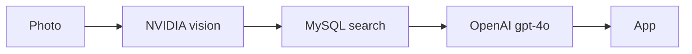

# UPAVANA — Technical picture (Gate 3)

**Send this page only.** Draft for consent. ~1 minute.

**What it does:** photo in → plant, issue, next step, and how sure we are.

## Locked stack

| | |
|---|---|
| App | React Native / Expo |
| Server | Java, Spring Boot |
| Data | MySQL + Flyway |
| Sees the photo | NVIDIA vision (`llama-3.2-11b-vision-instruct`) |
| Writes the answer | OpenAI **`gpt-4o`** (strict JSON) |
| If OpenAI fails | NVIDIA text (`llama-3.1-8b-instruct`) — **test this before demo** |
| DeepSeek | **Off.** Do not run. |
| `gpt-4o-mini` | Later chat only. Not this demo. |

## Flow

`Photo → save → NVIDIA vision → MySQL search → OpenAI gpt-4o → save → app`

Vision is NVIDIA only (not OpenAI, not Claude). Missing NVIDIA key = clear error.

## Search (dual RAG)

Look up *our* research notes, then answer from those notes. Never dump the whole DB.

| Match | Confidence | User sees |
|-------|------------|-----------|
| Plant name in DB | **High** | Research-based treatment OK |
| Symptoms only | **Medium** | Pattern may apply; plant not confirmed |
| Nothing | **Low** | **Unidentified Issue** + safe general advice. No fake disease. |

## Not in this demo

No login. No chat. No store listing. No CMS. No extra AI vendors.

## Risks we already planned for

| Risk | Plan |
|------|------|
| OpenAI down | NVIDIA text backup (must test end-to-end) |
| Wrong plant name from vision | Symptom search still runs (Medium) |
| AI too sure | High / Medium / Low labels |
| Code still calls DeepSeek | Next coding story: switch to OpenAI |

## Need from you

| # | Ask |
|---|-----|
| 1 | Approve this picture (do **not** re-pick Java / RN / MySQL / NVIDIA vision / `gpt-4o`) |
| 2 | **OQ-1 (blocks demo):** name **3–5 plant + disease pairs** we must pass |
| 3 | OQ-8 (optional): is research aimed at Indian / local conditions? |
