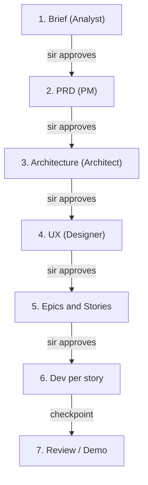

# BMAD Consent Workflow & AI Stack Realignment

## Purpose

This document records the agreed **restart approach** for Plant Doctor development under BMAD methodology: **supervisor consent at every stage**, while **keeping backend RAG architecture and diagnosis pipeline logic intact**, and **aligning AI providers with sir's original OpenAI dual-model direction**.

**Do not implement code changes described here until the relevant gate is explicitly approved by sir.**

---

## Supervisor Requirements (Source of Truth)

Sir specified:

| Layer | Requirement |
|-------|-------------|
| Backend | Java (Spring Boot) |
| Frontend | React Native |
| Database | MySQL |
| AI strategy | Cost-efficient **OpenAI** dual-model integration |

### Dual-model OpenAI strategy

| Traffic share | Use case | Model |
|---------------|----------|-------|
| ~90% | Conversation, chat understanding, follow-up questions, other high-frequency AI tasks | `gpt-4o-mini` (or latest mini-tier equivalent) |
| ~10% | Complex synthesis, structured diagnosis output | `gpt-4o` (or latest flagship tier) with **strict structured outputs** (`response_format: { type: "json_schema", ... }`) |

**Development note from sir:** Explore OpenAI free / low-cost options during development (verify current OpenAI dev credits and trial limits at implementation time).

### Team proposal (pending sir approval)

| Stage | Provider | Role |
|-------|----------|------|
| Vision | **NVIDIA NIM** (keep current) | Image → text description (`analyzeImage`) |
| RAG retrieval | **MySQL** (unchanged) | `plants` / `diseases` candidate lookup |
| Synthesis | **OpenAI `gpt-4o`** + JSON schema | Final diagnosis JSON (replaces DeepSeek) |
| Future chat | **OpenAI `gpt-4o-mini`** | Follow-up Q&A (Phase 5, not yet built) |

**Remove from MVP path (after approval):** DeepSeek synthesis (`DEEPSEEK_API_KEY`, `synthesizeDiagnosisWithDeepSeek`).

---

## Current State vs Target (Gap Analysis)

| Layer | Sir's direction | Built today | Gap |
|-------|-----------------|-------------|-----|
| Stack | Java + RN + MySQL | ✅ Same | — |
| Vision | Not specified; team proposes NVIDIA | NVIDIA NIM | Needs sir sign-off |
| Synthesis | `gpt-4o` + JSON schema | DeepSeek (+ NVIDIA text fallback) | **Must change** |
| Chat / follow-up | `gpt-4o-mini` | Not built | Phase 5 |
| RAG flow | Vision → retrieve → synthesize | ✅ Same shape | Keep |
| Planning docs | OpenAI in `AGENTS.md` | PRD/architecture say DeepSeek (OQ-2) | **Docs out of sync** |

**Important:** Backend RAG pipeline and `/api/diagnose` contract should be preserved. This is a **provider swap and documentation refresh**, not a rewrite.

---

## Proposed AI Pipeline (Target Architecture)

```
Photo upload
    → NVIDIA Vision NIM          (image → text description)
    → RAG retrieval              (MySQL plants/diseases — unchanged)
    → OpenAI gpt-4o + JSON schema (structured DiagnosisResult)
    → Persist Query + respond to mobile

(Future) Follow-up chat
    → OpenAI gpt-4o-mini
```

### Proposed fallback chain (for sir approval)

| Priority | Model | When |
|----------|-------|------|
| Primary | `gpt-4o` + `json_schema` | Normal diagnosis synthesis |
| Fallback | `gpt-4o-mini` + `json_schema` | Primary failure or rate limit |
| Not used | DeepSeek, NVIDIA text for synthesis | Removed after migration |

Vision remains NVIDIA-only; do not route images to OpenAI unless sir explicitly requests a change.

---

## BMAD Stage-Gate Workflow (Consent at Every Stage)

Present **one artifact at a time**. Do not proceed until sir replies **APPROVED** or provides change requests.



### Gate 1 — Product Brief

| Item | Detail |
|------|--------|
| **Agent / skill** | `bmad-agent-analyst` (Mary) |
| **Artifact** | `_bmad-output/planning-artifacts/briefs/brief-plant-doctor-2026-08-01/brief.md` |
| **Ask sir** | "Is this the problem we are solving?" |
| **Update needed** | Replace "NVIDIA-only AI" wording with **NVIDIA vision + OpenAI dual-model synthesis** |

### Gate 2 — PRD

| Item | Detail |
|------|--------|
| **Agent / skill** | `bmad-agent-pm` (John) |
| **Artifact** | `prd.md`, `addendum.md` |
| **Ask sir** | "Are these requirements and FRs correct?" |
| **Update needed** | Replace OQ-2 / AD-6 DeepSeek resolution with OpenAI dual-model table |

### Gate 3 — Architecture

| Item | Detail |
|------|--------|
| **Agent / skill** | `bmad-architecture` (Winston) |
| **Artifact** | `ARCHITECTURE-SPINE.md` |
| **Ask sir** | "Is this the technical contract?" |
| **Update needed** | AD-6 → NVIDIA vision + OpenAI gpt-4o synthesis + gpt-4o-mini for chat |
| **Course correction** | AD-3 / AD-4 (plant-name-only RAG) vs **symptom-pattern RAG** implemented in code — requires sir decision |

### Gate 4 — UX (recommended for demo)

| Item | Detail |
|------|--------|
| **Agent / skill** | `bmad-ux` (Sally) |
| **Artifact** | `DESIGN.md`, `EXPERIENCE.md` |
| **Ask sir** | "Is this the experience we demo?" |

### Gate 5 — Epics & Stories

| Item | Detail |
|------|--------|
| **Agent / skill** | `bmad-create-epics-and-stories` |
| **Ask sir** | "Is this the build order?" |

### Gate 6 — Development

| Item | Detail |
|------|--------|
| **Agent / skill** | `bmad-dev-story`, `bmad-quick-dev` |
| **Rule** | One story at a time; checkpoint after each |

### Gate 7 — Review / Demo

| Item | Detail |
|------|--------|
| **Agent / skill** | `bmad-checkpoint-preview`, `bmad-code-review` |
| **Ask sir** | Demo acceptance before next epic |

---

## Supervisor Approval Email Template

**Subject:** Plant Doctor — [Stage name] for approval

1. **One-page summary** — problem, solution, scope
2. **Artifact link or attachment**
3. **Decisions needing yes/no:**
   - NVIDIA vision OK?
   - OpenAI `gpt-4o` for diagnosis synthesis OK?
   - Symptom-pattern RAG across plants OK? (vs plant-name-only per original AD-3)
4. **Explicit ask:** *"Please reply APPROVED or list changes before we proceed to [next stage]."*

---

## Code Change Scope (After Gate 3 Approval Only)

### Keep unchanged

- `DiagnosisService` RAG orchestration flow (save image → vision → retrieve → synthesize → persist → return)
- `findCandidateDiseases()` logic (including symptom-pattern matching if sir approves)
- MySQL schema, Flyway migrations, CSV seeding
- `POST /api/diagnose` contract and `DiagnosisResult` JSON shape
- Mobile screens and API integration (no change required for provider swap)

### Change after approval

| Area | Action |
|------|--------|
| AI clients | Split or refactor `NvidiaClientService` → vision client + `OpenAiClientService` |
| Synthesis | Replace `synthesizeDiagnosisWithDeepSeek` with OpenAI `gpt-4o` + JSON schema |
| Config | Add `OPENAI_API_KEY`, model names in `application.yml`; remove DeepSeek env vars |
| Tests | Update mocks for OpenAI client |
| Docs | `AGENTS.md`, `project-context.md`, PRD addendum, architecture AD-6 |

---

## Artifacts Reuse vs Refresh

### Reusable (~70%)

- Brief problem statement, target users, MVP scope
- PRD functional requirements (FR-1 through FR-18)
- Architecture pipeline ordering (AD-5)
- UX specs and Upavana branding

### Must refresh after sir approval

| File | Section |
|------|---------|
| `brief.md` | AI provider / cost strategy |
| `prd.md` + `addendum.md` | FR-7, OQ-2, AI provider table |
| `ARCHITECTURE-SPINE.md` | AD-6, diagram, env vars; possibly AD-3/AD-4 |
| `_bmad-output/project-context.md` | AI stack rules |
| `AGENTS.md` | Tech stack AI line (already says OpenAI — align code to match) |
| `backend/.env.example` | OpenAI keys; deprecate DeepSeek |

---

## Open Decisions for Sir

| ID | Question | Options |
|----|----------|---------|
| **D-1** | Approve NVIDIA for vision only? | Yes / No — use OpenAI vision instead |
| **D-2** | Approve OpenAI `gpt-4o` + JSON schema for synthesis? | Yes / No |
| **D-3** | Approve `gpt-4o-mini` fallback for synthesis failures? | Yes / No |
| **D-4** | RAG retrieval: plant-name-only (AD-3) or symptom-pattern across plants (current code)? | Plant-only / Symptom-pattern / Both |
| **D-5** | Remove DeepSeek entirely from MVP? | Yes / No |

---

## Immediate Next Step

1. Send sir the **one-page AI stack addendum** (summary section of this document).
2. Wait for **APPROVED** before coding OpenAI integration.
3. On approval, run Gate 1–3 artifact updates in order (`bmad-prd` update intent, `bmad-architecture` update).
4. Then implement OpenAI synthesis as a discrete dev story.

---

## Revision History

| Date | Change |
|------|--------|
| 2026-08-03 | Initial document — BMAD consent workflow + AI stack realignment proposal |
